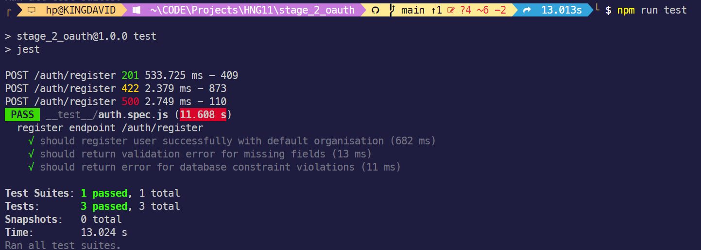
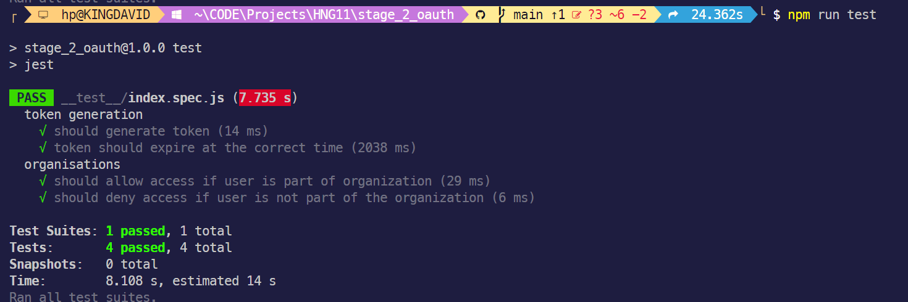
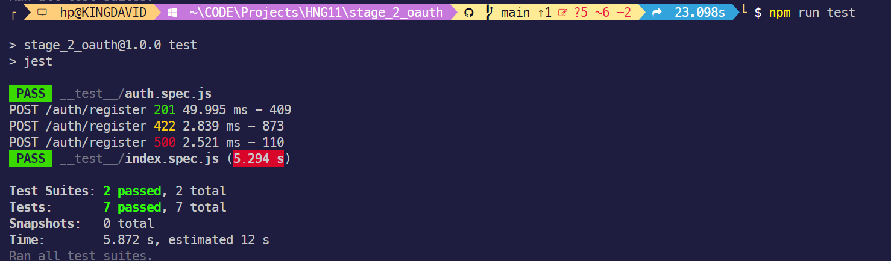

# Stage 2 OAuth

This is a Node.js application that provides authentication and authorization functionality using JSON Web Tokens (JWT). The application includes the following routes and endpoints:

## Server

The `server.js` file is the entry point of the application. It sets up the Express server and middleware, and defines the following routes:

- `GET /`: Retrieves all users from the database.
- `GET /*`: Handles non-existing routes and returns a 404 error.

## Authentication Routes (`/auth`)

The authentication routes are defined in the `routes/index.js` file and handle user registration and login.

### `POST /auth/register`

Registers a new user by creating a user record in the database and an organization associated with the user. The request body should contain the following fields:

- `firstName`
- `lastName`
- `email`
- `password`
- `phone` (optional)

### `POST /auth/login`

Authenticates a user by checking the provided email and password against the database. The request body should contain the following fields:

- `email`
- `password`

## User Routes (`/api/users`)

The user routes are defined in the `routes/user.js` file and handle user-related operations.

### `GET /api/users/:id`

Retrieves the user's information based on the provided `id`. This route is protected and requires a valid JWT token in the `Authorization` header.

## Organization Routes (`/api/organisations`)

The organization routes are defined in the `routes/organisations.js` file and handle organization-related operations.

### `GET /api/organisations/`

Retrieves all organizations that the authenticated user belongs to. This route is protected and requires a valid JWT token in the `Authorization` header.

### `GET /api/organisations/:orgId`

Retrieves the details of a specific organization identified by `orgId`. This route is protected and requires a valid JWT token in the `Authorization` header. Additionally, the user must have access to the requested organization.

### `POST /api/organisations/`

Creates a new organization for the authenticated user. The request body should contain the following fields:

- `name`
- `description`

This route is protected and requires a valid JWT token in the `Authorization` header.

### `POST /api/organisations/:orgId/users`

Adds a user to an existing organization identified by `orgId`. The request body should contain the following field:

- `userId`

This route is protected and requires a valid JWT token in the `Authorization` header.

# Unit Test & e2e

## Server

The `createApp.js` file is responsible for creating the Express application instance and setting up the routes and middleware. It includes the following functionality:

- Middleware setup (morgan, express.json, express.urlencoded)
- Root route (`GET /`) to retrieve all users from the database
- Authentication routes (`/auth`) for user registration and login
- User routes (`/api/users`) for retrieving user information
- Organization routes (`/api/organisations`) for managing organizations and user access
- Error handling middleware for non-existing routes and global errors
- 
### `auth.spec.js`

- Tests the `POST /auth/register` endpoint for successful user registration, validation errors, and database constraint violations.

### `index.spec.js`

- Tests the token generation functionality, including token expiration and user details.
- Tests the organization access middleware (`checkOrgAccess`) to ensure users can't access organizations they don't have access to.

### All Test running
- Time taken to run 2 test
- check if there are no conflict on each other
